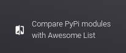
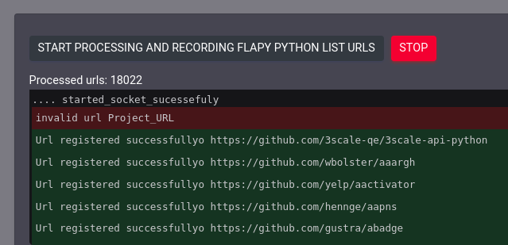
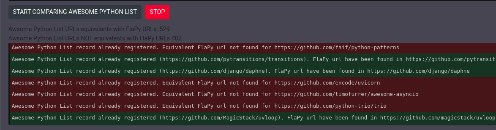
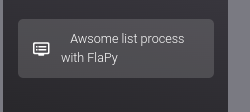
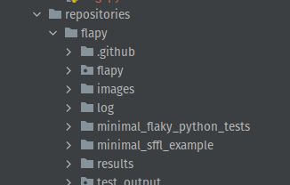

# FlapyTools

## Instalação:
Utilizando python 3.11, em uma venv ou conforme preferir.

instalar os requirements

````
pip install -r requirements.pip 
````

Alterar settings.py para incluir seu usuario e senha do banco de dados, e se desejar o nome
da base de dados também, por padrão está configurada para "flapy_tools"
````
createdb flapy_tools
````

Dentro da pasta do arquivo manage.py executar
````
python manage.py migrate
````

### Instalando a imagem docker

Primeiro é necessário fazer o download da imagem docker modificada do FlaPy, disponivel no link:

https://drive.google.com/drive/folders/1qcnbKJ6Rx9YxgB7bHX4YHPSc5w95gSaD?usp=sharing

Considerando que a instalação do docker foi realizada corretamente, para o SO que estiver sendo utilizado,  executar no terminal:
````
docker load --input custom_flapy_image.tar
````

## Utilização:
Para executar a aplicação, no terminal executar 
````
python manage.py runserver  
````
Acessar pelo navegador a url indicada no terminal, ou por padrão ````http://127.0.0.1:8000/````

Para processar a lista de urls do FlaPy ou a que desejar (estando no mesmo formato de arquivo)
expandir no menu lateral a opção Compare PiPy modules with awsome list.



Clicar no botão  Start processing and recording FlaPy Python list URLs, e aguardar todas URLs serem processadas.
                

Terminando este procedimento, clicar na opção  Start comparing Awesome Python list para comparar as URLs
cadastradas com as utilizar pelo Awsome Python, ou que estejam no mesmo formato na pasta [extracted_files](FlapyTools%2Fextractor%2Fextracted_files) [links_awsome_python.txt](FlapyTools%2Fextractor%2Fextracted_files%2Flinks_awsome_python.txt)

Aguarde a conclusão da comparação 


Para executar a ferramenta FlaPy com uma execução, expanda no meu lateral a opção    "Awsome list process with FlaPy"


Execute na seguinte ordem:
1 - Run filtered projects on FlaPy with one run and save log data: Para executar os projetos filtraos com apenas uma run, para ser utilizado
para verificar se é possivel utilizar a ferramenta naquele projeto ou não.

2-  Check filtered projects that run on FLAPY. Para verificar os logs gerados e realizar a verificação de que projetos
podem ser executados pela ferramenta ou não.

3-  Run filtered projects using 400 runs with random order and save log, Para executar todos os projetos
filtrados pelas etapas anteriores, porém com 400 runs gerando o log.

4-  Extract CSV of the 400 runs log result, para extrair o csv gerado pela ferramenta FlaPy incluido no log.

Sendo possível observar os resultados pelo log do mesmo terminal que foi aberto servidor com o comando runsever.


## Informações Adicionais:
Se desejar, para analisar os resultados obtidos pelo painel de admin, criar um superusuario pelo terminal, conforme abaixo

````
python manage.py createsuperuser
````

Acessar o admin pela url (substituindo pelo ip e porta observados ao executar o comando runserver)
````http://127.0.0.1:8000/admin/````

Soluções de problemas:
Atualzar o cache da página do navegador, reiniciar o servidor, abrir e fechar a página.

Caso não gere os logs corretamente, verificar se a pasta results foi criada corretamente, caso não,
ou crie manualmente ou verifique se o projeto tem as permissoes necessárias para criar pastas.
 